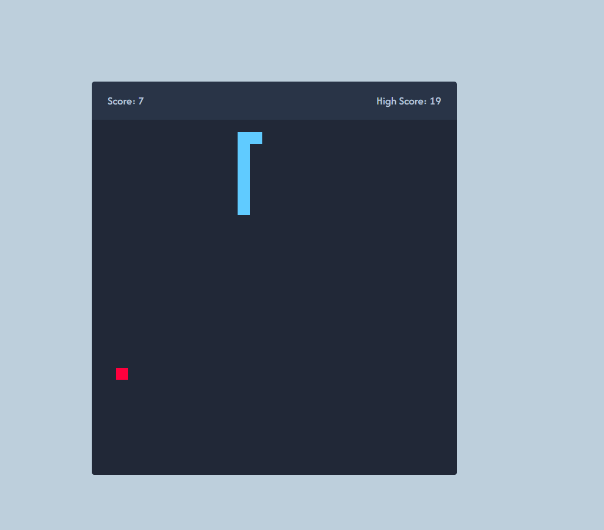

# 🐍 Snake Game

A modern, minimalistic implementation of the classic **Snake Game**, built using HTML, CSS, and JavaScript.  
Control the snake, eat food, and try to survive as long as possible!

Play the game here 👉 [Live Demo](https://anstacy.github.io/Snake-Game/)

## ✨ Features

- 🎮 Keyboard controls for intuitive gameplay
- 📱 Touch controls for mobile
- 🍎 Food appears randomly on the grid
- 💥 Game over on collision with walls or self
- 🕐 Real-time score tracking
- 💾 Minimalist, responsive design for desktop & mobile

## 🧠 How It Works

The snake moves continuously on a grid-based canvas.  
Each time it eats a food item:

- Its body grows
- A new food appears in a random position

Game ends when the snake hits a wall or itself.

## 🛠️ Tech Stack

- **HTML5** – Game structure
- **CSS3** – Grid layout and styling
- **JavaScript (ES6)** – Core game logic, rendering, and interaction

## 🚧 Future Improvements

- 🏆 High score tracking (local storage)
- 🎨 Custom themes or skins
- 🎶 Sound effects and background music
